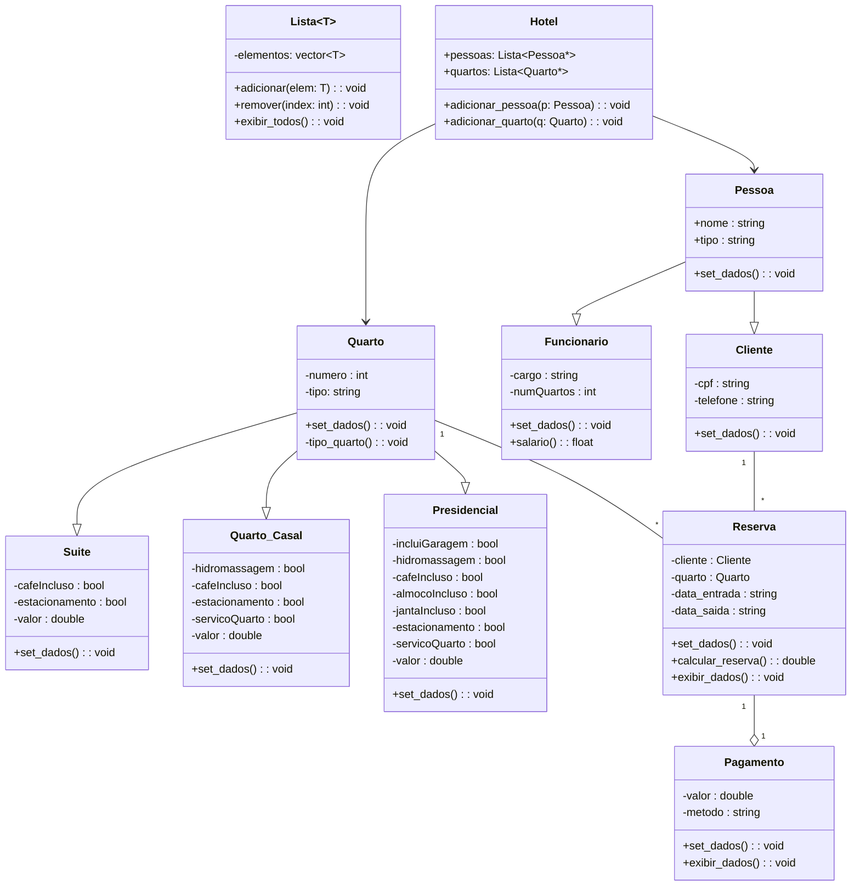

# Classes

```mermaid
classDiagram
    class Lista~T~ {
        -elementos: vector~T~
        +adicionar(elem: T) : void
        +remover(index: int) : void
        +exibir_todos() : void
    }

    class Hotel {
        +pessoas: Lista~Pessoa*~
        +quartos: Lista~Quarto*~
        +adicionar_pessoa(p: Pessoa) : void
        +adicionar_quarto(q: Quarto) : void
    }

    class Pessoa {
        +nome : string
        +tipo : string
        +set_dados() : void
    }

    class Cliente {
        -cpf : string
        -telefone : string
        +set_dados() : void
    }

    class Funcionario {
        -cargo : string
        -numQuartos : int
        +set_dados() : void
        +salario() : float
    }

    class Quarto {
        -numero : int
        -tipo: string
        +set_dados() : void
        -tipo_quarto() : void
    }

    class Suite {
        -cafeIncluso : bool
        -estacionamento : bool
        -valor : double
        +set_dados() : void
    }

    class Quarto_Casal {
        -hidromassagem : bool
        -cafeIncluso : bool
        -estacionamento : bool
        -servicoQuarto : bool
        -valor : double
        +set_dados() : void
    }

    class Presidencial {
        -incluiGaragem : bool
        -hidromassagem : bool
        -cafeIncluso : bool
        -almocoIncluso : bool
        -jantaIncluso : bool
        -estacionamento : bool
        -servicoQuarto : bool
        -valor : double
        +set_dados() : void
    }

    class Reserva {
        -cliente : Cliente
        -quarto : Quarto
        -data_entrada : string
        -data_saida : string
        +set_dados() : void
        +calcular_reserva() : double 
        +exibir_dados() : void
    }

    class Pagamento {
        -valor : double
        -metodo : string
        +set_dados() : void
        +exibir_dados() : void
    }

    %% Herança
    Pessoa --|> Cliente
    Pessoa --|> Funcionario

    Quarto --|> Suite
    Quarto --|> Quarto_Casal
    Quarto --|> Presidencial

    %% Composição
    Hotel --> Pessoa
    Hotel --> Quarto

    Cliente "1" -- "*" Reserva
    Quarto "1" -- "*" Reserva
    
    Reserva "1" --o "1" Pagamento
```
